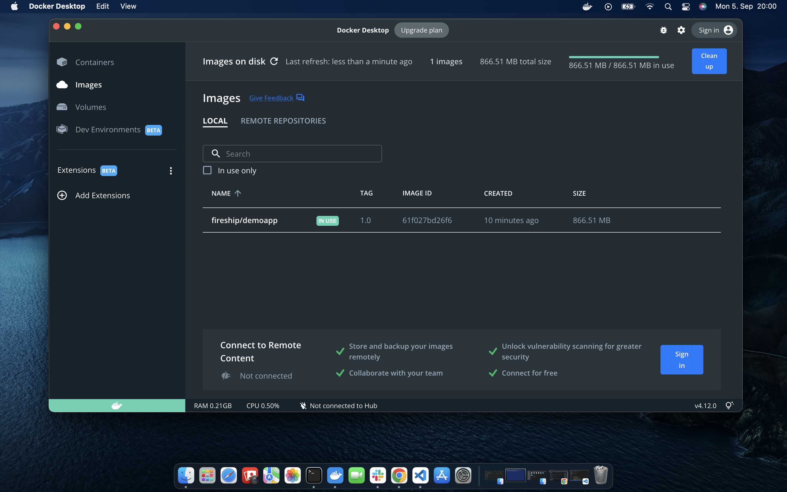

# Encapsulate a Node.JS server in a docker container 

This tutorial is inspired by fireship.io and shows how to encapsulate a NodeJS Server in a docker container. 

You can host the server locally via 

```
npm install 
```

and then 

```
npm start 
```

respectively 

```
node index.js 
```

or 

```
nodemon index.js 
```

Which let's you observe the running server on `localhost:8080` as specified in the `index.js`. 
But we will start "Docker Desktop" and create a docker-container via 

```
docker build -t fireship/demoapp:1.0 .
```

When finished you can verify the result by typing: 

```
docker image ls 
```

which should show the following output 


You should also be able to see the image id in your "Docker Desktop" app 



The command 

```
docker run -p 5001:8080 <image-id>
````

will host the docker container. You can observe the result on `localhost:5001`. 